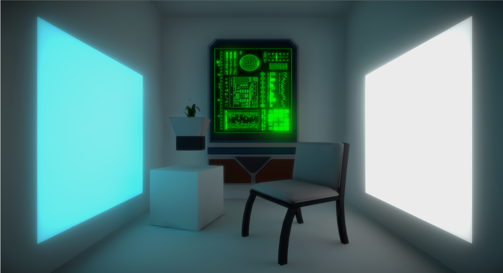
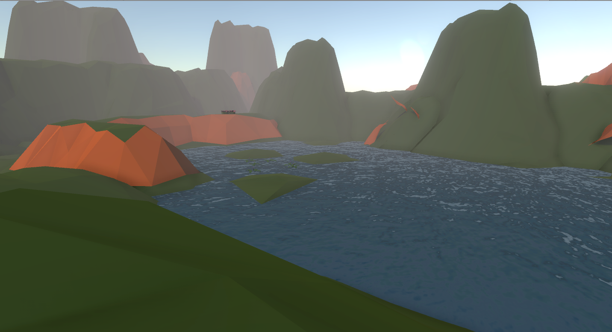
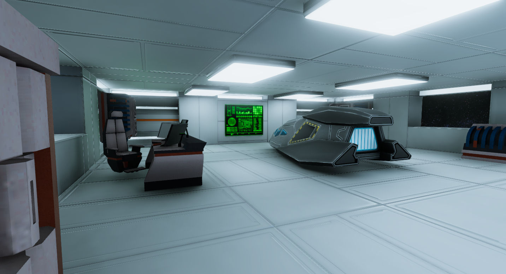
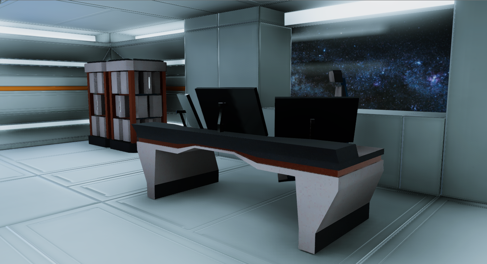
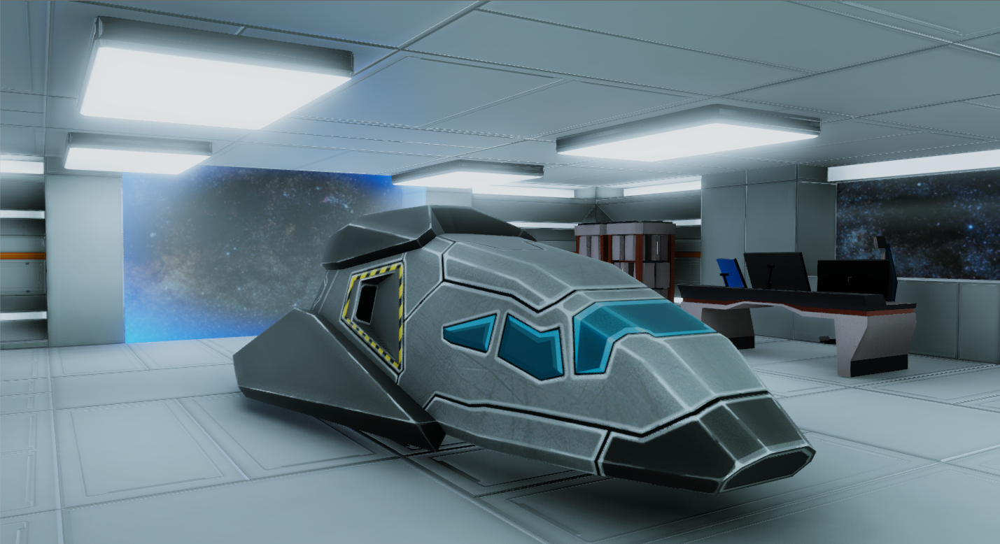

# Unity Portfolio

Some of the project where I have been involved using Unity.

I was a developer lead for a Unity plugin, comissioned by a video-game company called Larva Studios, that was able to detect detect the body, and map it to a rigged model using the Kinect sensor; this served as a MOCAP system within Unity. The plugin also detected the palms of the hands. 

The plugin was used to create two video-games:

For the hand tracking, a modelling game:

and for the MOCAP, a game where you control a car and an airplane with body postures. Several gestures were detected, such as raising the arms, or flexing:

The project included in this repository contains three scenes where several lighting effects, as well as the post-processing stack, have been implemented. 

The first scene is a simple box with objects, where three light sources are in play. 

The second is a low-poly valley, with several elements, including a lake. 

 
 

The final scene is a Sci-fi landing dock, with more complex lighting.

 
 
 
