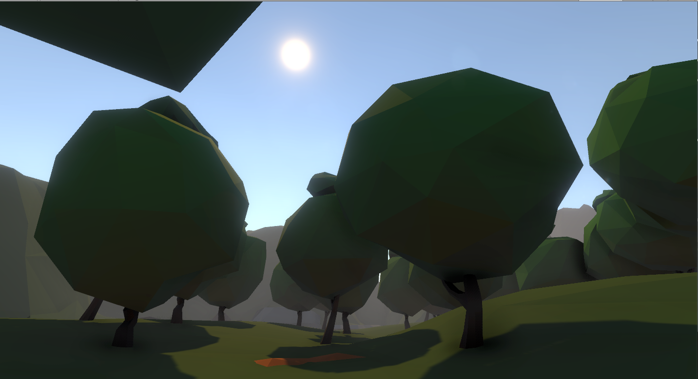

# Portfolio-Unity
Some of the work I have created with Unity.

The project contains three scenes where several lighting effects, as well as the post-processing stack, have been implemented. 

The first scene is a simple box with objects, where three light sources are in play. 

The second is a low-poly valley, with several elements, including a lake. 

 
 
 

The final scene is a Sci-fi landing dock, with more complex lighting.

 
 
 
